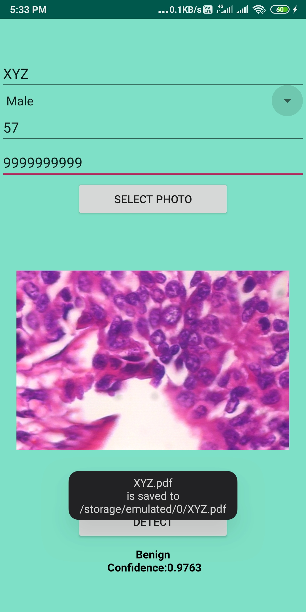

## Plant Diseases Detector
The project is broken down into multiple steps:
* Building and creating a machine learning model using TensorFlow with Keras
* Deploying the model to an Android application using TFLite

### Screenshots

  

### App demo
[Breast Cancer Classifier Demo](.assets/demo.mp4)

### Libraries
* [Tensorflow 2.0](https://www.tensorflow.org/)
* [TensorFlow Lite ](https://www.tensorflow.org/lite)

### Programming Languages
* Python
* Kotlin
